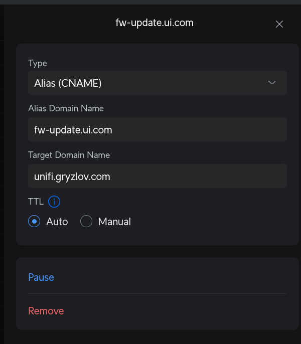
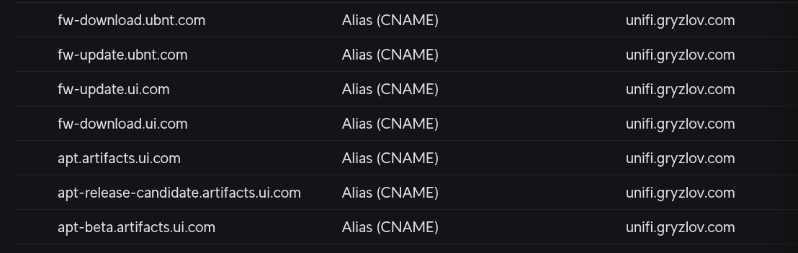

## Автоматическое обновление

Настройка сводится к перенаправлению доменов обновлений на этот прокси-сервер. В таком случае трафик от оборудования пойдет не напрямую к серверам Ubiquiti, а через этот сервер в Албании.

Это позволит консолям UniFi скачивать обновления в штатном режиме, не подозревая о подмене маршрута. Вам нужно создать как минимум пять перенаправлений доменов:

`fw-download.ubnt.com`<br/>
`fw-update.ubnt.com`<br/>
`fw-update.ui.com`<br/>
`fw-download.ui.com`<br/>
`apt.artifacts.ui.com`<br/>

Если используете Release Candidate или Beta прошивки, также нужны:

`apt-release-candidate.artifacts.ui.com`<br/>
`apt-beta.artifacts.ui.com`<br/>


---

### 📝  Настройка DNS



Данные настройки делаются в веб-интерфейсе UniFi Network, в приложении на данный момент нет возможности задавать DNS записи.

1. Перейдите в **Settings → Policy Table**.
2. Создайте новый **Policy** типа **DNS**.
3. Тип записи: **Alias (CNAME)**.
4. В поле **Alias Domain Name** укажите домен, который нужно перенаправить.
5. В поле **Target Domain Name** укажите адрес прокси `unifi.gryzlov.com`
6. Повторите для всех остальных доменов.
<br clear="all" />

> Если ваша версия UniFi Network не позволяет задавать CNAME записи, то прописывать Host (A) бесполезно, так как, из-за бага в UniFi Network, в DNS ответы будут подмешиваться ответы разного типа и этот хак не сработает. Рекомендуем для старых версий UniFi Network использовать /etc/hosts.

В итоге у вас должны появится следующие записи в **Policy Table**:




---


### 💪  Через /etc/hosts

Если по какой-то причине ваша версия UniFi Network слишком старая или не позволяет задавать DNS записи, но у вас есть доступ к SSH, то можно прописать IP адреса напрямую в файл **/etc/hosts** на вашем устройстве или роутере:

1. Включите **SSH** в настройках UniFi и задайте пароль.
2. Подключитесь к роутеру: `ssh root@<ip-адрес-роутера>`.
3. Откройте файл для редактирования: `vi /etc/hosts`.
4. Нажмите **i** для режима вставки и добавьте в **конец файла** указанный ниже блок.
5. Нажмите **Esc**, затем наберите `:wq` и нажмите Enter для сохранения и выхода из редактора.

```text
103.167.234.147  fw-download.ubnt.com
103.167.234.147  fw-update.ubnt.com
103.167.234.147  fw-update.ui.com
103.167.234.147  fw-download.ui.com
103.167.234.147  apt.artifacts.ui.com
103.167.234.147  apt-release-candidate.artifacts.ui.com
103.167.234.147  apt-beta.artifacts.ui.com
```


<style>

.inline-code-wrap {
    margin-top: 4px;
}

/* Картинка create-cname: на мобильном без float, на всю ширину */
@media (max-width: 768px) {
    img.example {
        float: none !important;
        display: block;
        width: 100% !important;
        max-width: 100%;
        margin-left: 0 !important;
        margin-right: 0 !important;
        height: auto;
        padding-top: 20px;
    }
}

</style>